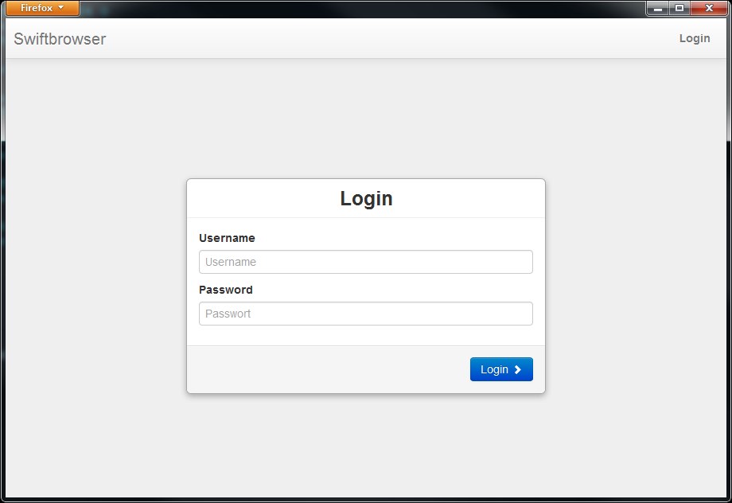
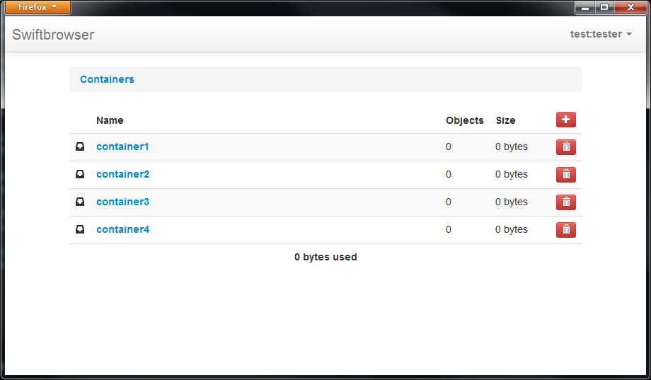

django-swiftbrowser
===================

Simple web app build with Django and Twitter Bootstrap to access Openstack Swift.

* No database needed
* Works with keystone, tempauth & swauth
* Support for public containers. ACL support in the works
* Minimal interface, usable on your desktop as well as on your smartphone
* Screenshots anyone? See below!

Quick Install
-------------

1) Install swiftbrowser:

    pip install django-swiftbrowser

2) Please make sure that "tempurl" and "formpost" middlewares are activated in your proxy server. Extract from /etc/swift/proxy-server.conf:

    [pipeline:main]
    pipeline = catch_errors gatekeeper healthcheck proxy-logging cache tempurl formpost tempauth proxy-logging proxy-server

    [filter:tempurl]
    use = egg:swift#tempurl

    [filter:formpost]
    use = egg:swift#formpost

3) Run development server:

    django-admin runserver --settings=swiftbrowser.settings

4) Open "http://127.0.0.1:8000/" in your browser and use 'account:username' to login (or tenant/project:username if using Keystone).

Screenshots
-----------

